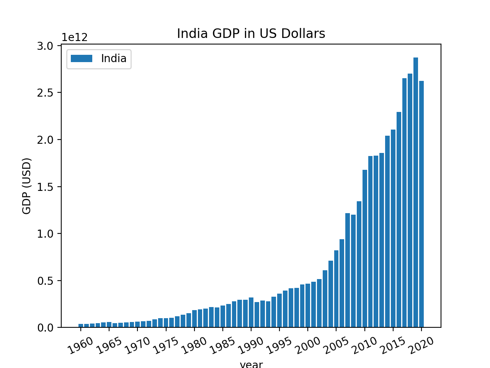

# Visualizing-data-in-python

## India's GDP in $US Over Time

This first plot shows India's GDP over time in US Dollars for the last 60 years. As you can see pretty clearly, the increase in GDP progresses almost exponentially up until 2019. The link to the original datasouce is [here](http://api.worldbank.org/v2/countries/IND/indicators/NY.GDP.MKTP.CD?per_page=5000&format=json).

## China vs. India's Population Growth Over Time

This plot compares India and China's populations over the last 60 years. The y-axis units are in billions and as seen in the graph, India's population is catching up to China's rapidly and if this trend continues, India will be the highest populated country in the world. The link to the original datasource is [here](http://api.worldbank.org/v2/countries/CHN/indicators/SP.POP.TOTL?per_page=5000&format=json) for China and [here](http://api.worldbank.org/v2/countries/IND/indicators/SP.POP.TOTL?per_page=5000&format=json) for India. 

 

[Here](https://github.com/mikeizbicki/cmc-csci040/tree/2021fall/hw_02) are the project instructions for this assignment. 

